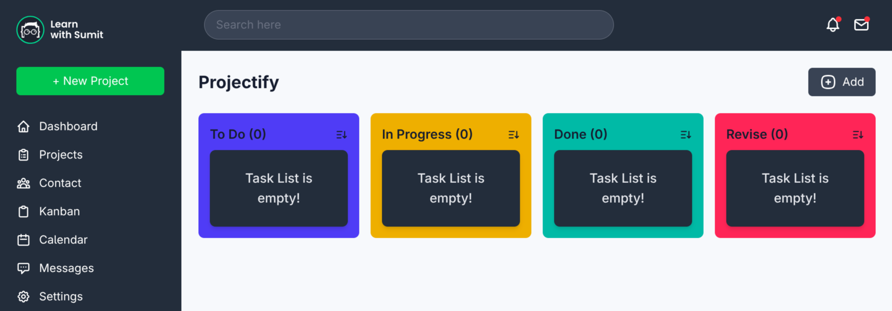
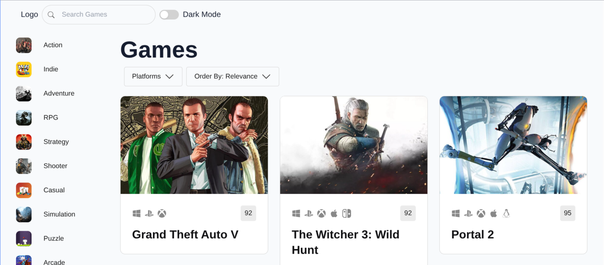
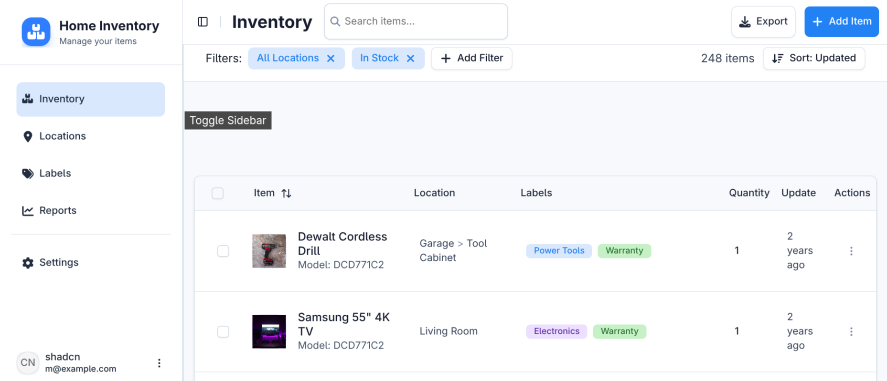
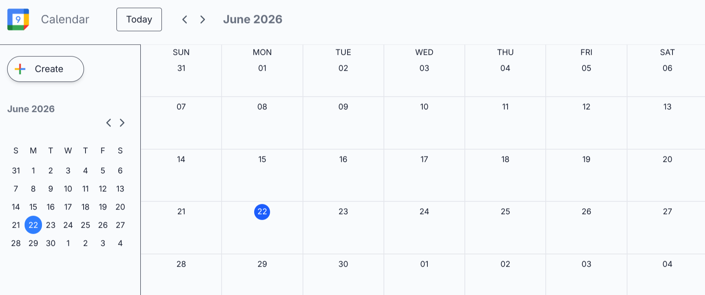
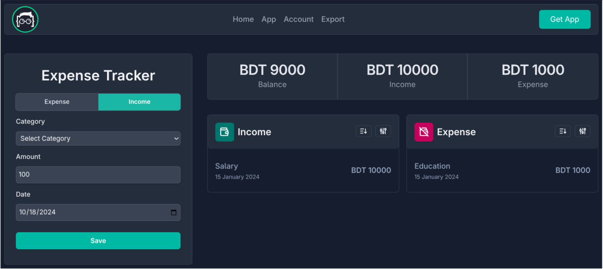
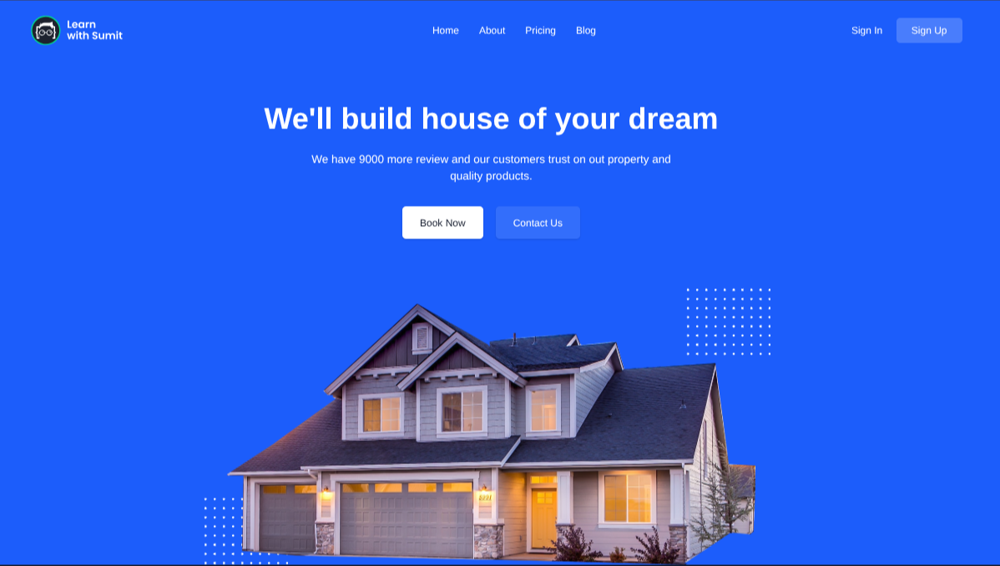
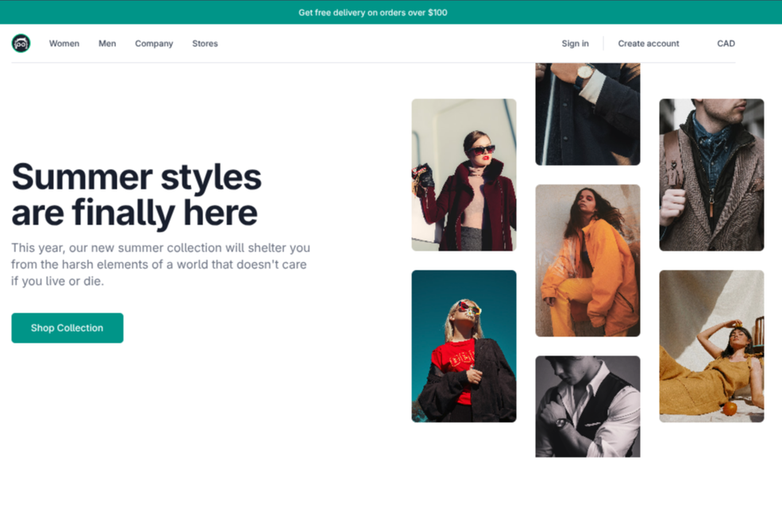
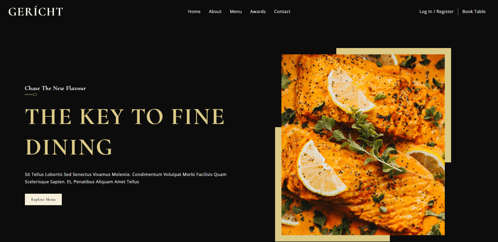
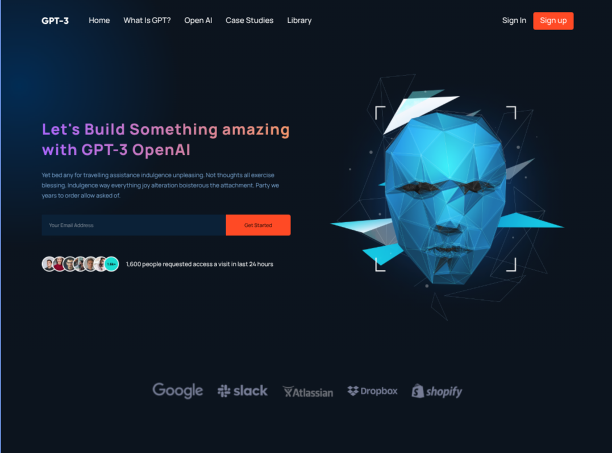

# Project Manager: Streamline Your Tasks

---

[Live Website](will be added later)

The "Project Manager" is a modern UI/UX application that celebrates workflow efficiency and task organization. Crafted with ReactJS, this responsive web application promises a delightful user experience, marrying visual allure with culinary discovery.

## Key Highlights:

1. _ReactJS Brilliance_: Leveraging the power of ReactJS, Project Manager ensures a dynamic, responsive and efficient user interface.

---

# GameHub: Discover Your Next Adventure

[Live Website](will be added later)

The "GameHub" is a modern UI/UX application that celebrates video game discovery and rich catalog filtering. Crafted with ReactJS, this responsive web application promises a delightful user experience, marrying visual allure with culinary discovery.

## Key Highlights:

1. _ReactJS Brilliance_: Leveraging the power of ReactJS, GameHub ensures a dynamic, responsive and efficient user interface.

---

# Inventory: Precision Layout Translation

[Live Website](will be added later)

The "Inventory" is a modern UI/UX application that celebrates static Figma translation and structured dashboard layouts. Crafted with ReactJS, this responsive web application promises a delightful user experience, marrying visual allure with culinary discovery.

## Key Highlights:

1. _ReactJS Brilliance_: Leveraging the power of ReactJS, Inventory ensures a dynamic, responsive and efficient user interface.

---

# Event Calendar: Plan Your Schedule

[Live Website](will be added later)

The "Event Calendar" is a modern UI/UX application that celebrates dynamic agenda tracking and structured time grids. Crafted with ReactJS, this responsive web application promises a delightful user experience, marrying visual allure with culinary discovery.

## Key Highlights:

1. _ReactJS Brilliance_: Leveraging the power of ReactJS, Event Calendar ensures a dynamic, responsive and efficient user interface.

---

# Quizzes: Interactive Knowledge Testing

[Live Website](will be added later)

The "Quizzes" is a modern UI/UX application that celebrates interactive questionnaire engines and protected layout states. Crafted with ReactJS, this responsive web application promises a delightful user experience, marrying visual allure with culinary discovery.

## Key Highlights:

1. _ReactJS Brilliance_: Leveraging the power of ReactJS, Quizzes ensures a dynamic, responsive and efficient user interface.

---

# Expense Tracker: Manage Personal Capital

[Live Website](will be added later)

The "Expense Tracker" is a modern UI/UX application that celebrates balance sheet calculation and transactional tracking. Crafted with ReactJS, this responsive web application promises a delightful user experience, marrying visual allure with culinary discovery.

## Key Highlights:

1. _ReactJS Brilliance_: Leveraging the power of ReactJS, Expense Tracker ensures a dynamic, responsive and efficient user interface.

---

# Real Estate: Browse Premium Properties

[Live Website](will be added later)

The "Real Estate" is a modern UI/UX application that celebrates real estate listing boards and structural filter systems. Crafted with ReactJS, this responsive web application promises a delightful user experience, marrying visual allure with culinary discovery.

## Key Highlights:

1. _ReactJS Brilliance_: Leveraging the power of ReactJS, Real Estate ensures a dynamic, responsive and efficient user interface.

---

# Product List: Streamlined Catalog Matrix

[Live Website](will be added later)

The "Product List" is a modern UI/UX application that celebrates consumer catalog parsing and clean display items. Crafted with ReactJS, this responsive web application promises a delightful user experience, marrying visual allure with culinary discovery.

## Key Highlights:

1. _ReactJS Brilliance_: Leveraging the power of ReactJS, Product List ensures a dynamic, responsive and efficient user interface.

---

# Gericht Restaurant: A Feast for the Eyes and Taste Buds

[Live Website](will be added later)

The "Gericht Restaurant" is a modern UI/UX application that celebrates culinary excellence and design sophistication. Crafted with ReactJS, this responsive web application promises a delightful user experience, marrying visual allure with culinary discovery.

## Key Highlights:

1. _ReactJS Brilliance_: Leveraging the power of ReactJS, Gericht Restaurant ensures a dynamic, responsive and efficient user interface.

---

# Modern UI UX: Next-Gen AI Presentation

[Live Website](will be added later)

The "Modern UI UX" is a modern UI/UX application that celebrates futuristic tech landing elements and component flows. Crafted with ReactJS, this responsive web application promises a delightful user experience, marrying visual allure with culinary discovery.

## Key Highlights:

1. _ReactJS Brilliance_: Leveraging the power of ReactJS, Modern UI UX ensures a dynamic, responsive and efficient user interface.

---

# Issue Tracker: Agile Defect Resolution

[Live Website](will be added later)

The "Issue Tracker" is a modern UI/UX application that celebrates priority pipeline tracking and task assignment flows. Crafted with ReactJS, this responsive web application promises a delightful user experience, marrying visual allure with culinary discovery.

## Key Highlights:

1. _ReactJS Brilliance_: Leveraging the power of ReactJS, Issue Tracker ensures a dynamic, responsive and efficient user interface.

---

# Portfolio: Engineering Project Showcase

[Live Website](will be added later)

The "Portfolio" is a modern UI/UX application that celebrates professional experience hubs and project timeline showcases. Crafted with ReactJS, this responsive web application promises a delightful user experience, marrying visual allure with culinary discovery.

## Key Highlights:

1. _ReactJS Brilliance_: Leveraging the power of ReactJS, Portfolio ensures a dynamic, responsive and efficient user interface.
