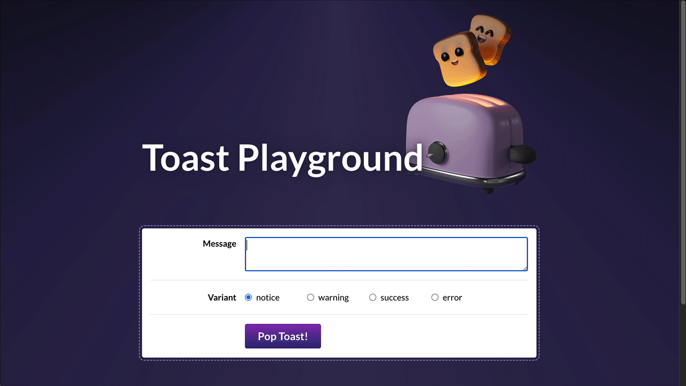

# Toast Component Project

## Joy of React, Project II

In this project, we'll dive deep into the implementation of a single common UI component: A `<Toast>` message component.

## Getting Started

This project is created with [Vite](https://vite.dev/). It's intended to be run locally, on your computer, using Deno and NPM.

Here are the terminal commands you'll need to run:
